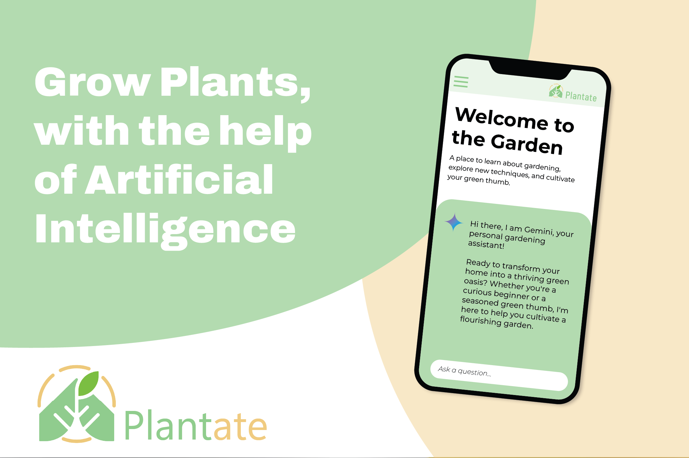

# Plantate

If the virtual environment is not set up, run the following command:

```
python3 -m venv .venv
```

Then, use the virtual environment to install the python dependencies.

```
pip3 install -r requirements.txt
```

Rename `.env.example` to `.env` and add your [gemini api key](https://aistudio.google.com/app/apikey)
```
GEMINI_API_KEY=<PASTE API KEY HERE>
```

Run the flask application.

```
flask --app app.py run --debug
```
